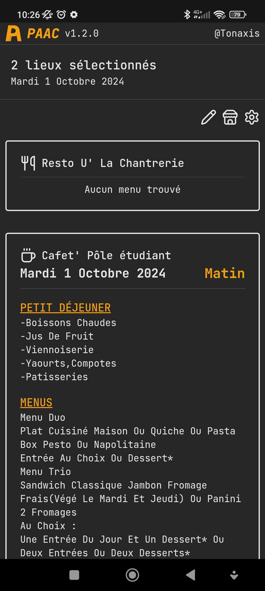
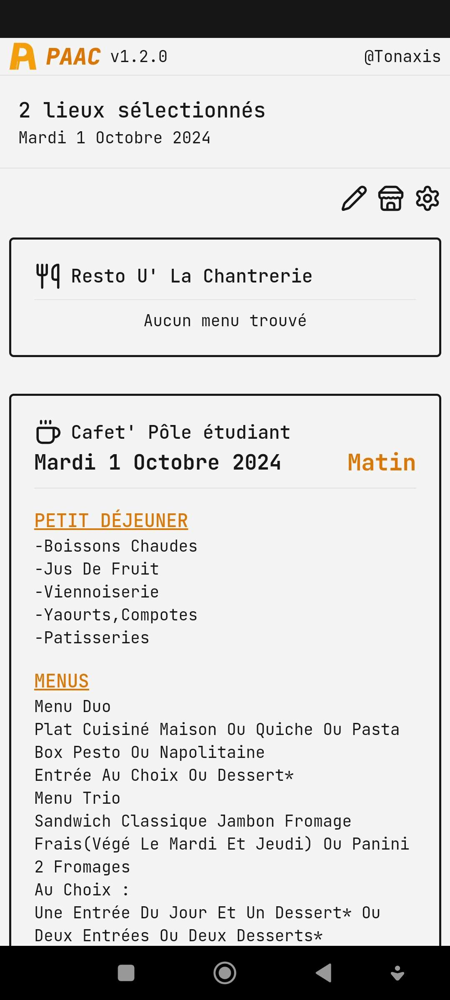
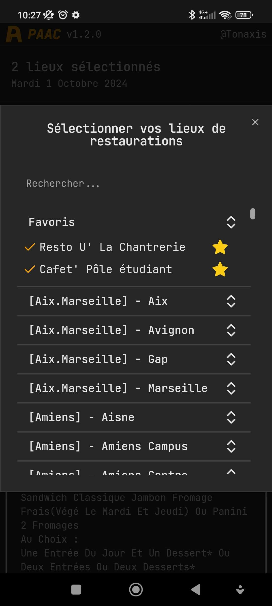
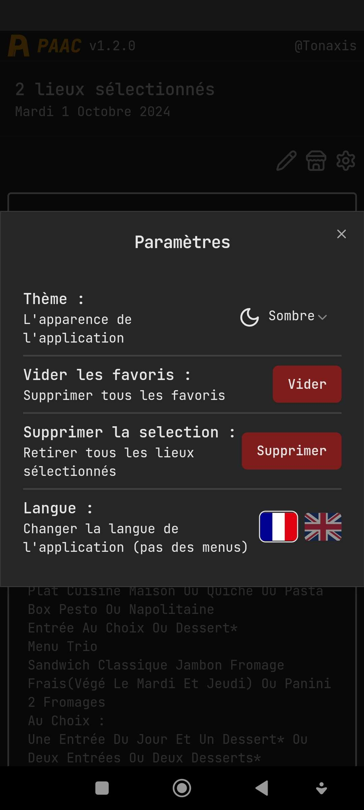

<h1 align="center">
  <br>
  <a href="https://paac.tonaxis.fr"></a>
  <br>
  Paac
  <br>
</h1>

<h4 align="center">Suivi des menus du CROUS par <a href="https://github.com/Tonaxis" target="_blank">@Tonaxis</a>.</h4>

<p align="center">
  <a href="https://github.com/Tonaxis/Paac/tags"></a>
</p>

![img/screenshot-desktop.png]

## Fonctionnalités

- **Hors connexion** / installation en mode **PWA**
- Sélection **multiple** de lieux de restauration
- Thème clair / thème sombre
- Sélection de la langue
  - Français
  - English

> N'hésitez pas à créer une issue pour notifier d'une erreur ou proposer une fonctionnalité !

## Comment ça marche ?

L'application est développé en [React](https://fr.react.dev) avec une api en [Go](https://go.dev). Le tout est containerisé dans une image Docker.

### API :

L'api sert de relais à l'application vers les données. Elle va requêter les sources de données puis les traiter avant de les retourner à l'application.

- `/restaurants` : retourne la liste de tout les lieux de restauration
- `/restaurants/:dataset/:id` : restourne un lieu de restauration spécifique
- `/menus/:dataset/:id?date=yyyy-mm-dd` : retourne le menu lié a un lieu de restaurantion ciblé pour une date donnée

### Sources des données :

- [Lieux de restauration](https://www.data.gouv.fr/fr/datasets/restaurants-brasseries-et-cafeterias-des-crous/)
- [Menus](https://www.data.gouv.fr/fr/datasets/menus-des-restaurants-brasseries-et-cafeterias/#/resources)

## Installation

### Docker

### Docker pull

```sh
# Get image
docker pull ghcr.io/tonaxis/paac/paac

# Run image
docker run -p 80:80 --name paac ghcr.io/tonaxis/paac/paac
```

### Docker compose

Créez un fichier `docker-compose.yml` avec ce contenu

```yml
services:
  app:
    image: ghcr.io/tonaxis/paac/paac
    restart: always
    stdin_open: true
    tty: true
    ports:
      - "80:80"
```

Puis executer cette commande

```sh
docker compose up
```

### Git

```sh
# Clone the repository
git clone https://github.com/Tonaxis/Paac.git

# Go to the project
cd Paac

# Build image
docker build -t paac .

# Run image
docker run -p 80:80 --name paac paac
```

## Développement

### Nécessaire

- [Node.js](https://nodejs.org/fr/download/package-manager) 20.X
- [Go](https://go.dev/doc/install) 1.22.0

### Lancement

Lancement de l'api

```sh
cd paac-api
go run .
```

Lancement de l'application

```sh
cd paac-app
npm run dev
```

## Captures d'écran


<br>
